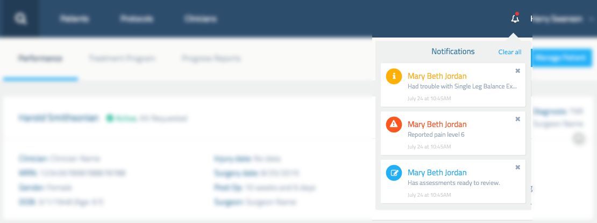

Reflexion Health Coding Challenge
=================================
Thank you for taking the time to complete this challenge. We realize this is
taking up some of your free time, so we really appreciate it.

Below is a description of an actual component in our application. We'd like to
see how you would go about building it. You are free to use *any* library or framework
you like. Our application is currently written in `Angular 1.4.x` but don't let that
limit you. If you wanna build it in React, go right ahead. All jQuery? That's fine too.
We're more interested in how you build the thing than what you choose to build it with.

We've provided a base HTML and CSS file, a mock-up, some data and that's it. Hopefully,
you'll find this fun and challenging.

Thanks again.

Background
----------
The product has two pieces. The first is a system a tele-rehabilitation platform.
The second piece is a web application used by clinician to review patient progress
and perform administration of a patients therapy plan.

Patients perform exercises as part of their in-home physical therapy. As they
perform their exercises they may report trouble with an exercise, or pain they
are experiencing. Each of these events needs to be reviewed by their clinician.

In addition to normal exercises, they may be asked to perform assessments. These
assessments need to be reviewed and scored by the clinician as well.

Each of these events is surfaced to the clinician as a 'notification.'

Notification Center
-------------------
The Notification Center is our solution for surfacing these notifications to the
clinician.

### Requirements
* If a clinician has 1 or more notifications, add an indicator to the notification icon
  in the header.
* When the user clicks on the notification icon, display the notification center.
* All notifications must include the patients name, notification text, and date/time.
* Pain notifications must be grouped if they occurred in the same therapy session.
    * The notification must include the total number of times pain was reported, and the maximum pain level
    * "Reported pain `{times}` times with highest pain `{level}`"
* Assessment review notifications must be grouped by patient.
    * The notification must include the total number of assessments that need review.
    * "Has assessments ready to review"
* Clicking on a notification opens a patient summary view. You don't need to implement
  this view, but all notifications must handle click events somehow.
* An individual notification can be dismissed
    * If this a "grouped" notification based on the rules above, all of the individual
      notifications used to make that group must also be dismissed.
      * Typically this would be done by making a request to an API with an array of
        `id`s to delete. For this challenge, that isn't required. However, your solution
        needs to keep this in mind.
* The clinician must have the option to clear all notifications.
    * Unlike dismissing a grouped notification, all notifications can be cleared with
      a single API request that doesn't require any `id`s

### Stuff you'll need to complete this Challenge
* And `index.html` file and `main.css` file have been provided in order to stub out
  the basic navigation bar for the application.
* A mock-up has been provided. See `challenge.png`.

* The `notifications.json` file contains a JSON dump to be used for building this component.
* There are exactly 3 types of notifications; all are represented in the JSON and mock-up.
* Here is a list of colors to be used
  * `#2d4d6d` - Headers
  * `#1fb0f8` - Links & To Review notifications
  * `#97a8bc` - Message text
  * `#ffb003` - Trouble notifications
  * `#fd571d` - Pain notifications
  * `#d0d2d2` - Dates
  * `#eff0f0` - Container background
* For icons, we are using [Font Awesome](http://fortawesome.github.io/Font-Awesome/icons/)

### Stuff you don't need to worry about
You don't need to worry about mocking out API requests, you can if you choose to though.
That being said, the fact that there is an API should inform your decisions.